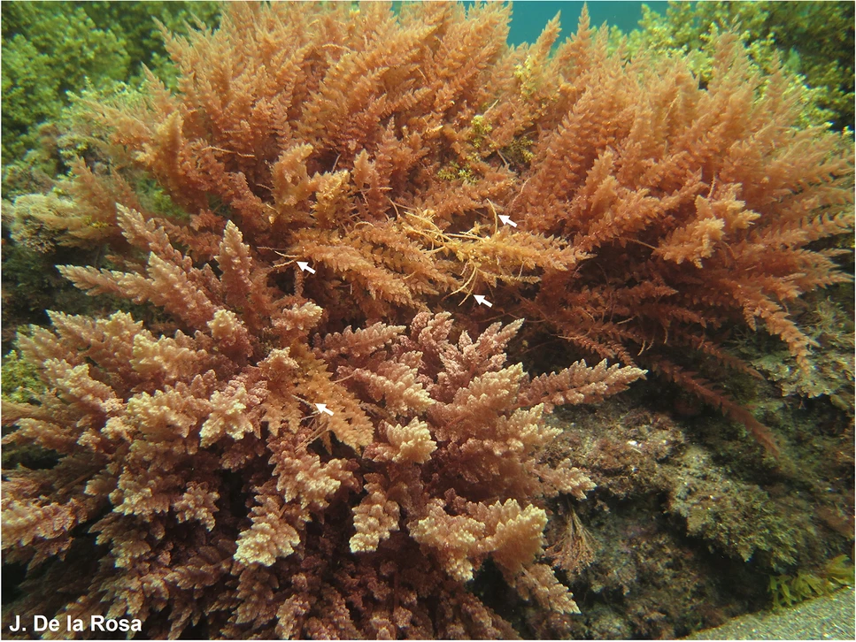
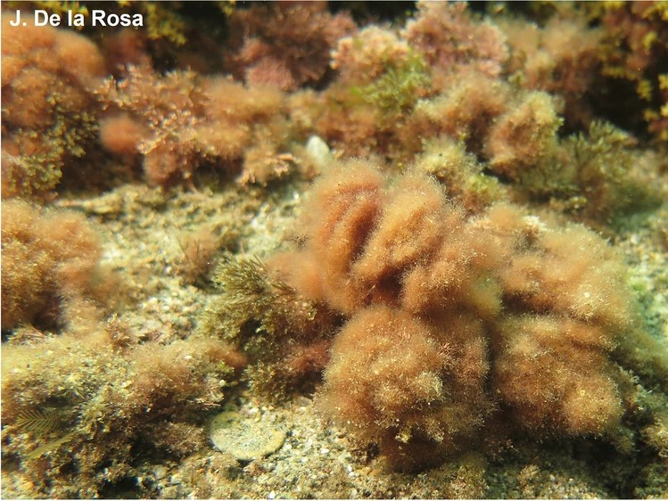
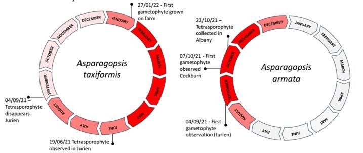

```{r setup}
#| include: FALSE

library(tidyverse)
library(units)
library(cowplot)
library(formatdown)
library(raster)
library(sp)
library(knitr)
library(macrogrow)
library(conflicted)
conflicts_prefer(dplyr::select(), dplyr::filter(), .quiet = T)
packs <- c('units', 'cowplot', 'formatdown', 'raster', 'sp', 'knitr', 'macrogrow', 'conflicted')

knitr::opts_knit$set(root.dir = file.path("C:", "Users", "treimer", "Documents", "R-temp-files", "modelling-asparagopsis"))
# This markdown uses TinyTex - install with tinytex::install_tinytex()
```

```{r note}
#| code-summary: "All the code in this markdown is set to 'fold' by default. Click each folded code chunk to see its inner workings."

# You did it!
```

# Introduction

```{r globals}
#| code-summary: "Some global defaults I like to use"

base_path <- file.path("modelling-asparagopsis", "FRDC-seaweed")

prettyplot <- 
  theme_classic() +
  theme(element_text(family = "sans", size = 12, colour = "black"),
        axis.title.y = element_text(vjust = 2),
        legend.position = "none")

remove_unit("gDW")
install_unit("gDW")
remove_unit("gFW")
install_unit("gFW")
remove_unit("photons")
install_unit("photons")

# This allows me to convert between moles and g of nitrogen
remove_unit("gN")
install_unit("gN")
remove_unit("molN")
install_unit("molN", "14.0067 gN")

S_uM <- set_units(seq(0, 200, 0.5), "umolN L-1")
S_mg <- set_units(S_uM, "mgN m-3")
```

The _Asparagopsis_ genus (and especially _A. armata_) is invasive in the northeastern Atlantic and the Mediterranean [@zanolla_concise_2022]. It has been studied more as an invasive genus than a native one. 
There are two species (or species complexes) within the genus _Asparagopsis_: _A. armata_ is a temperate species while _A. taxiformis_ is more commonly found in tropical areas (including northern Australia), and this might affect the results of the modelling - I may need to parameterise two different species, possibly distinct only in their temperature/light tolerance. 

Phylogenetic analyses suggest that there is a clade within the species _A. armata_ restricted only to Western Australia, Tasmania and New Zealand [@dijoux_more_2014]. It has been proposed that the species _A. armata_ is actually two cryptic species: _A. armata_ 1 is native to Tasmania and is invasive in the northern hemisphere, while _A. armata_ 2 is restricted to Western Australia, Tasmania and New Zealand [@dijoux_more_2014; @zanolla_concise_2022].
Therefore, while the _A. armata_ studied as an invasive species (_A. armata_ 1) is partially representative of the Australian species, the lack of sampling in Australia and New Zealand may be leaving knowledge gaps of the potentially more widespread _A. armata_ 2. 
It's not known how much will this affect environmental growth responses in a model, given that the genus is very plastic in its environmental tolerance [@zanolla_concise_2022]. 

Both species follow a triphasic lifestyle, alternative between macroscopic diploid tetrasporophyte and haploid (male and female) gametophyte phases (@fig-morphology). Gametophytes produce gametes for sexual reproduction while tetrasporophytes produce tetrasporangia for asexual reproduction, and both phases additionally reproduce asexually through fragmentation [@zanolla_concise_2022]. 
The phases are easy to distinguish morphologically - gametophytes look somewhat like asparagus shoots (giving the genus name) and grow as branching shoots up to ~30 cm long. Tetrasporophytes are much smaller with finer fronds, resembling pom-poms []. 
Tetrasporophytes are usually found year-round, while gametophytes are often only found in colder months [@zanolla_size_2018]. The phases may differ in their responses to environmental temperature (particularly temperature and light) and knowing the phases is important because some studies do not specify which phase of _Asparagopsis_ they have collected or are working with. 

::: {#fig-morphology layout-ncol=2}




Left: Gametophytes of _Asparagopsis armata_ (above) and _A. taxiformis_ (below) at 5 m depth. Arrows point to harpoon-like branches in _A. armata_. Right: Tetrasporophyte of _Asparagopsis_ at 3-m depth, presenting pompom structure and attached to other algae. Collected from Granada, Spain. Photo credits: J. De la Rosa, reproduced from @zanolla_concise_2022.
:::

The different forms may also be very physiologically different in some respects - at the very least with regard to temperature and daylength. Catriona Hurd also thinks it's likely they'll be different in their uptake rates of the different forms of nitrogen.

```{r defaults, include=FALSE}
V_am <- K_am <- M_am <- C_am <- V_ni <- K_ni <- M_ni <- C_ni <- V_ot <- K_ot <- M_ot <- C_ot <- Q_min <- Q_max <- K_c <- mu <- N_min <- N_max <- D_m <- D_ve <- D_st <- D_lo <- D_mi <- D_hi <- a_cs <- I_o <- T_opt <- T_min <- T_max <- S_opt <- S_min <- S_max <- h_a <- h_b <- h_c <- h_max <- DWWW <- NA
K_c <- 6
```

## Limitation by other nutrients

It has been suggested that the model should include the possibility of phosphorus limitation, as well as nitrogen limitation (switching between the limiting nutrient based on availability/internal conditions). This was considered because the places where macroalgae is being grown for nitrogen bioremediation purposes (river outflows, next to fish farms) are likely to be very high in nitrogen but not necessarily phosphates. 

However, it was decided not to include phosphorus limitation. While the mechanics of including it would be fairly simple, research into the required parameters (shape and rate of uptake, internal requirements) are almost non-existent for _Asparagopsis_. @grisenthwaite_establishing_2023 may possibly have some of this data for tetrasporophytes(?) but I have yet to find anything similar for gametophytes. 
If the 'standard', not species-specific Atkinson ratio of N:P were assumed [@atkinson_cnp_1983], then the algae would require 1/30^th^ as much phosphorus as nitrogen to maintain the modelled growth. Given that macroalgae require so much more nitrogen than phosphorus, it seems unlikely that they are ever going to be phosphorus limited in coastal or oceanic waters. 
Phosphates are also not often measured in marine waters, so obtaining ambient data would be extremely difficult.

Still, if the Atkinson ratio (30:1 N:P) were assumed and phosphate uptake kinetics were ignored, then the minimum phosphate concentrations required to maintain the modelled growth can be estimated and reported as an additional consideration.

Also possibly carbon? Check @mata_direct_2010.

## Still to investigate

* @cole_using_2014
* @dishon_effect_2023
* @kraan_commercial_2005
* @mata_integrated_2008
* @monro_evolutionary_2007
* @torres_effects_2024
* @wiltshire_feasibility_2015
* @zanolla_there_2019

# Nitrogen uptake {#sec-nitrogen-uptake}
## Linear uptake {#sec-nitrogen-uptake-linear}

It's possible that the gametophyte and tetrasporophyte will have different uptake rates of ammonium and nitrate, and in the wild they do not appear to be affected by fluctuations in nutrients [@zanolla_concise_2022; @zanolla_structure_2018, @zanolla_assessing_2018]. However, if we assume that the gametophyte has a similar preference for ammonium to the sporophyte then it's not surprising that it would show little response to nutrients in the environment, as natural nitrogen is mostly in nitrate form with ammonium only being present at constant low levels generally. 

::: {.column-margin .callout-important}
@zanolla_assessing_2018 didn't directly measure nutrients(?) but found that temperature was highly correlated with species distribution. Check @zanolla_structure_2018 - did they measure nutrients?
:::

As far as I can tell, no-one has investigated nitrogen uptake directly in _Asparagopsis_ gametophytes. I will therefore be using the uptake rates calculated for the tetrasporophyte.

Some very interesting things from reading @torres_nitrogen_2021:

* Asparagopsis prefers ammonium during the internally-controlled (non-surge) phase
* Nitrate also taken up, but not preferred - even when nitrate was the only form available uptake was limited (limited use by seaweed)
* Amino acids (a mix of several different ones, with alanine dominating) were also tested. Amino acids are released by decomposing fish food. I may need to include amino acids as "other N" in the model.

@torres_nitrogen_2021 tested the surge and internally-controlled nitrogen uptake rates of _A. armata_ when given nitrogen in the form of ammonium, nitrate and a mix of amino acids (dominated by alanine). 
Nitrogen uptake (in all three forms) did not saturate at ~200 $\mu$M concentration, so was was better described with a linear equation rather than with Michaelis-Menton uptake kinetics

```{r torres 2021 nitrate}
#| code-summary: Import Torres et al. (2021) data

torresNO3 <- read.csv(file.path("data_raw", "sources", "torres_2021", "tores-2021-Fig2-B.csv"))

remove_unit("molN") # Torres 2021 only used N-15 so need to readjust the units for this data
install_unit("molN", "15 gN")
C_ni_alone <- set_units(mean(torresNO3$uptake[torresNO3$treatment == "alone"]), "umolN gDW-1 h-1")
C_ni_combo <- set_units(mean(torresNO3$uptake[torresNO3$treatment == "combo"]), "umolN gDW-1 h-1")
```

@torres_nitrogen_2021 did not calculate a linear uptake rate for nitrate when it was tested alone - only a constant rate of `r round(C_ni_alone, 2)` (or `r round(set_units(C_ni_alone, "mgN gDW-1 d-1"), 2)`). In combination nitrate was also taken up at a com
They did not offer an explanation beyond the observation that since _A. armata_ did not show an increase in uptake rate with concentration it likely has a limited capacity to use nitrogen. However this does not explain why they provided a slope and constant for linear uptake of nitrate in combination with other N forms, as that also did not show an increase in uptake rate with increasing concentration (although the relationship was not significant). 
I have decided to use a constant rate of nitrate uptake independent of concentration.


```{r torres 2021 rates}
#| code-summary: Calculate uptake rates from Torres 2021 data

# From Torres et. al. 2021, Table 3
M_am_alone <- set_units(0.12, "L h-1 gDW-1") 
C_am_alone <- set_units(10.45, "umolN h-1 gDW-1")

M_am_combo <- set_units(0.14, "L h-1 gDW-1")
C_am_combo <- set_units(8.79, "umolN h-1 gDW-1 ")

M_aa_alone <- set_units(0.007, "L h-1 gDW-1")
C_aa_alone <- set_units(1.69, "umolN h-1 gDW-1 ")

M_aa_combo <- set_units(0.006, "L h-1 gDW-1")
C_aa_combo <- set_units(0.88, "umolN h-1 gDW-1")

torres_uptake <- as.data.frame(S_uM) %>% 
  mutate(ammonium_alone = lin_uptake(S_uM, M_am_alone, C_am_alone),
         ammonium_combo = lin_uptake(S_uM, M_am_combo, C_am_combo),
         nitrate_alone = C_ni_alone,
         nitrate_combo = C_ni_combo,
         amacids_alone = lin_uptake(S_uM, M_aa_alone, C_aa_alone),
         amacids_combo = lin_uptake(S_uM, M_aa_combo, C_aa_combo)) %>% 
  pivot_longer(cols = !contains("S_uM"), 
               names_to = c("form", "treatment"), names_sep = "_",
               values_to = "uptake",
               names_transform = list(form = as.factor, treatment = as.factor)) %>% 
  mutate(S = set_units(S_uM, "mgN m-3"),
         uptake = set_units(uptake, "mgN gDW-1 d-1"))
```

Ammonium is obviously the preferred form of nitrogen uptake in _A. armata_. Amino acids and nitrate are taken up at approximately the same rate.

```{r torres 2021 plot}
#| code-summary: Plot N uptake based on Torres et al. (2021) data
#| fig-cap: |
#|    Linear uptake of ammonium (green), nitrate (blue) and amino acids (red) by _A. armata_. Dashed black lines show concentrations of 20 $\mu$M and 50 $\mu$M for reference.

int1 <- 20 %>% set_units("umolN L-1") %>% set_units("mgN m-3")
int2 <- 50 %>% set_units("umolN L-1") %>% set_units("mgN m-3")

ggplot(torres_uptake, aes(x = S, y = uptake, colour = form)) +
  geom_line() +
  facet_wrap(vars(treatment)) +
  geom_vline(aes(xintercept = int1), linetype = "dashed") +
  geom_vline(aes(xintercept = int2), linetype = "dashed") +
  labs(y = "Uptake rate", x = "Substrate concentration") +
  prettyplot + theme(legend.position = "bottom")
```

```{r reset N units}
#| code-summary: Reset molN back to 14.0067 g after Torres data

remove_unit("molN")
install_unit("molN", "15 gN")
```

## Michaelis–Menten uptake {#sec-nitrogen-uptake-MM}

@schuenhoff_tetrasporophyte_2006 fit a Michaelis–Menten curve to their uptake rates. 
They measured day and night uptake rates separately and combined. Their night and combined measurements were fairly poorly described by a Michaelis–Menten curve (R = 0.189 and 0.21 respectively) but daytime uptake was better (R$^2$ = 0.78). Since the model doesn't have a day-night cycle anyway, I'll be looking at the daytime parameters only.

```{r schuenhoff MM plot}
#| code-summary: Plot curves based on Schuenhoff et al. (2006) data
#| fig-cap: |
#|    Michaelis–Menten uptake of ammonium by _A. armata_. Dashed black lines show concentrations of 5 $\mu$M, 20 $\mu$M and 50 $\mu$M for reference.

V_am <- 14.85 %>% set_units("umolN gDW-1 h-1")
K_am <- 10.01 %>% set_units("umolN L-1")

schuen_uptake <- data.frame(S = S_uM) %>% 
  mutate(uptake = MM_uptake(conc = S_uM, V = V_am, K = K_am),
         S = set_units(S_uM, "mgN m-3"),
         uptake = set_units(uptake, "mgN gDW-1 d-1"),
         form = factor("ammonium", levels = levels(torres_uptake$form)))

int1 <- 5 %>% set_units("umolN L-1") %>% set_units("mgN m-3")
int2 <- 20 %>% set_units("umolN L-1") %>% set_units("mgN m-3")
int3 <- 50 %>% set_units("umolN L-1") %>% set_units("mgN m-3")

schuen_uptake %>% 
  filter(S <= set_units(1000, "mgN m-3")) %>% 
  ggplot(aes(x = S, y = uptake, colour = form)) +
  geom_line() +
  geom_vline(aes(xintercept = int1), linetype = "dashed") +
  geom_vline(aes(xintercept = int2), linetype = "dashed") +
  geom_vline(aes(xintercept = int3), linetype = "dashed") +
  labs(y = "Uptake rate", x = "Substrate concentration") +
  theme_classic() + theme(legend.position = "bottom")
```

It's immediately obvious that even though ammonium uptake by MM kinetics increases quickly at low concentrations, the linear uptake rate calculated by @torres_nitrogen_2021 is higher than the MM uptake rate calculated by @schuenhoff_tetrasporophyte_2006, especially at low (5 $\mu$M) and very high (50 $\mu$M) concentrations. 

```{r both uptake plot}
#| code-summary: Compare Michaelis–Menten uptake with linear uptake of ammonium
#| fig-cap: |
#|    Uptake of ammonium by _A. armata_ via Michaelis–Menten kinetics (blue) or a linear rate (red) with increasing substrate concentration (maximum of 30$\mu$M). Dotted lines show reference concentrations of 5, 20 and 50 $\mu$M for reference.

both_uptake <- merge(torres_uptake, schuen_uptake, by = c("S", "form"), all = T) %>% 
  rename(torres = uptake.x, schuenhoff = uptake.y) %>% 
  pivot_longer(names_to = "source", values_to = "uptake", cols = c(torres, schuenhoff), 
               names_transform = list(source = as.factor))

both_uptake %>% 
  filter(S_uM <= set_units(55, "umolN L-1")) %>% 
  ggplot(aes(x = S, y = uptake, color = form, linetype = source)) +
  geom_line(linewidth = 0.75) +
  facet_wrap(vars(treatment)) +
  geom_vline(aes(xintercept = int1), linetype = "dotted") +
  geom_vline(aes(xintercept = int2), linetype = "dotted") +
  geom_vline(aes(xintercept = int3), linetype = "dotted") +
  labs(y = "Uptake rate", x = "Substrate concentration") +
  prettyplot + theme(legend.position = "bottom")
```

```{r set uptake params}
#| code-summary: Choose which params of those investigated will make it into the model

V_am <- V_am # From Schuenhoff
K_am <- K_am # From Schuenhoff

M_am <- M_am_combo # From Torres
C_am <- C_am_combo # From Torres

M_ni <- 0 # From Torres (constant uptake)
C_ni <- C_ni_combo # From Torres

M_ot <- M_aa_combo # From Torres
C_ot <- M_aa_combo # From Torres
```

# Internal nutrient state {#sec-internal-nitrogen}
## Tissue nitrogen concentration {#sec-tissue-nitrogen}

The model requires minimum and maximum internal nitrogen concentrations. There are a couple of ways to go about estimating these:

* Take the lowest and highest N-concentrations I can find in the literature
* Take the lowest and highest protein concentrations I can find in the literature, and convert these into nitrogen. Protein estimates are much easier to find than N-concentration estimates, but the conversion to nitrogen adds uncertainty. 

### Direct search

@mata_direct_2010 reported that _A. armata_'s N-content was 6.04% of DW at harvesting in December, up from 5.90% at the time of stocking (or 5.56% up to 5.62% in May). 

```{r mata 2010 fig 1 and 2 data}
#| code-summary: Clean up data from @mata_direct_2010

# Data from Figure 1
mata_data_Y <- read.csv(file.path("data_raw", "sources", "mata_2010", "figure_1.csv")) %>% 
  rename(biomass_yield = `Biomass.yield.gDW.m.2.d.1`,
         TAN_flux = `Weekly.average.TAN.flux.umol.L.1.h.1`) %>% 
  mutate(biomass_yield = biomass_yield %>% set_units("gDW m-2 d-1"),
         TAN_flux = TAN_flux %>% set_units("umolN L-1 h-1"),
         species = as.factor(species),
         month = as.factor(month))

# Data from Figure 2
mata_data_N <- read.csv(file.path("data_raw", "sources", "mata_2010", "figure_2.csv")) %>% 
  rename(biofiltration = `Biofiltration..g.N.m.2.d.1.`,
         TAN_flux = `Weekly.average.TAN.flux.umol.L.1.h.1`) %>% 
  mutate(biofiltration = biofiltration %>% set_units("gN m-2 d-1"),
         TAN_flux = TAN_flux %>% set_units("umolN L-1 h-1"),
         measure = as.factor(measure),
         species = as.factor(species),
         month = as.factor(month)) %>% 
  pivot_wider(names_from = measure, values_from = biofiltration)

# Plot data just to check it matches Mata 2010 - it does
# ggplot(data = filter(mata_data_Y, species == "A. armata"), 
#        aes(x = TAN_flux, y = biomass_yield, colour = month)) +
#   geom_point() 
# ggplot(data = filter(mata_data_N, species == "A. armata"), 
#        aes(x = TAN_flux, y = N_yield, colour = month)) +
#   geom_point() 
```

```{r mata 2010 fig 1 and 2 parameters}
#| code-summary: Create curves from @mata_direct_2010 parameters

# Parameters from Figure 1 (May)
biom_Y_Vmax <- 153.6 %>% set_units("gDW m-2 d-1") # this is per m2 of a tank with SA=0.23m2
biom_Y_Ks <- 48.4 %>% set_units("umolN L-1 h-1")
biom_Y <- data.frame(flux = seq(0, 2000)) %>% 
  mutate(flux = flux %>% set_units("umolN L-1 h-1"),
         biom_yield = MM_uptake(flux, V = biom_Y_Vmax, K = biom_Y_Ks))

# Parameters from Figure 2 (May, N-yield)
N_Y_Vmax <- 9.5 %>% set_units("gDW m-2 d-1")
N_Y_Ks <- 60.3 %>% set_units("umolN L-1 h-1")
N_Y <- data.frame(flux = seq(0, 200)) %>% 
  mutate(flux = flux %>% set_units("umolN L-1 h-1"),
         N_yield = MM_uptake(flux, V = N_Y_Vmax, K = N_Y_Ks))

# Plot data just to check it matches Mata 2010 - it does
# ggplot(data = N_Y, aes(x = flux, y = N_yield)) +
#   geom_line() + prettyplot
# ggplot(data = biom_Y, aes(x = flux, y = biom_yield)) +
#   geom_line() + prettyplot

N_biom <- merge(biom_Y, N_Y, by = "flux") %>% 
  mutate(N_biom = N_yield/biom_yield)

# ggplot(N_biom, aes(x = biom_yield, y = N_biom)) +
#   geom_point()

max_N_biom <- max(N_biom$N_biom, na.rm = T)
min_N_biom <- min(N_biom$N_biom, na.rm = T)
```

<!-- Using the parameters from @mata_direct_2010, I estimate a maximum N-content of `r round(max_N_biom*100,2)`% and a minimum N-content of `r round(min_N_biom*100,2)`%. -->

@mata_direct_2010 reported that the maximum N-content of _A. armata_ in their study was 6.18%, and the minimum (at stocking, not starved) was 5.56% $\pm$ 0.13%. @schuenhoff_tetrasporophyte_2006 reported a maximum N-content of 6.5% and found that the C- and N-content of their tank-grown _A. armata_ remained consistent regardless of available TAN (TAN range 0-400 $\mu$mol l$^{-1}$ h$^{-1}$).

### Protein conversion

Maximum (or, at least, very high) internal nitrogen concentrations for _Asparagopsis_ are fairly easy to find. _A. taxiformis_ had a protein content of 22.69 %DM in @nunes_evaluation_2024 and 23.76 %DM in @pacheco_invasive_2020. @nunes_evaluation_2024 also found that _A. armata_ had a protein concentration of 24.23 %DM. However, the _A. taxiformis_ spp. gametophytes eaten in Hawaii have also been reported having protein concentrations <10 %DW [@mcdermid_nutritional_2003], and all of these measurements came from the invasive range of _Asparagopsis_.

Samples of _A. armata_ collected from New Zealand showed a protein concentrations ranging from of 10.94 to 15.2 %DW [@mihaila_new_2022; @zemke-white_chlorophyte_1999], while Australian samples of _A. taxiformis_ had mean a protein concentration of 18.2 %DW [@brooke_methane_2020]. 

```{r internal N gametophyte}
#| code-summary: Range of protein concentrations

P_range_taxi <- sort(c(22.69, 23.76, 18.2, 7.5)) # Asparagopsis taxiformis
P_range_arma <- sort(c(24.23, 15.2, 10.94)) # Asparagopsis armata

N_conv_aspara <- 5.63
N_range_taxi_aspara <- P_range_taxi/N_conv_aspara # Asparagopsis taxiformis
N_range_arma_aspara <- P_range_arma/N_conv_aspara # Asparagopsis armata

N_conv_reds <- 5.1
N_range_taxi_reds <- P_range_taxi/N_conv_reds # Asparagopsis taxiformis
N_range_arma_reds <- P_range_arma/N_conv_reds # Asparagopsis armata
```

There are two observations made from this. First, _A. armata_ appears to have a slightly higher average protein concentration than _A. taxiformis_, although this might be due to small sample sizes and a lack of direct comparison. Second, the samples collected from Australia and New Zealand had a much lower protein concentration than those collected elsewhere [@nunes_evaluation_2024; @mihaila_new_2022], possibly reflecting the region's naturally low nitrogen levels. 
Luckily, these results can still be useful as there appear to be no significant differences between the protein content of cultured and wild macroalgae, so intra-species variation is probably the largest factor determining the protein content of most macroalgae [@angell_protein_2016]. 

There are also different possible ways of converting protein to nitrogen: @angell_protein_2016 suggested that a factor `r N_conv_reds` is most appropriate for red algae, although they also reported _Asparagopsis_ specifically having a conversion factor of `r N_conv_aspara` which was used by @mihaila_new_2022 in their calculations. The results of these conversions are summarised in @tbl-protein-conversions.

| Species | Stat | Protein % | N (reds) | N (_Asparagopsis_)
|:-----:|:-----:|:-----:|:-----:|:-----:|
|                 | Mean | `r round(mean(P_range_arma),2)` | `r round(mean(N_range_arma_reds),2)` | `r round(mean(N_range_arma_aspara),2)` |
| _A. armata_     | Min  | `r round(min(P_range_arma),2)`  | `r round(min(N_range_arma_reds),2)`  | `r round(min(N_range_arma_aspara),2)`  |
|                 | Max  | `r round(max(P_range_arma),2)`  | `r round(max(N_range_arma_reds),2)`  | `r round(max(N_range_arma_aspara),2)`  |
|                 | Mean | `r round(mean(P_range_taxi),2)` | `r round(mean(N_range_taxi_reds),2)` | `r round(mean(N_range_arma_reds),2)`   |
| _A. taxiformis_ | Min  | `r round(min(P_range_taxi),2)`  | `r round(min(N_range_taxi_reds),2)`  | `r round(min(N_range_arma_reds),2)`    |
|                 | Max  | `r round(max(P_range_taxi),2)`  | `r round(max(N_range_taxi_reds),2)`  | `r round(max(N_range_arma_reds),2)`    |
: Observed protein concentrations in _Asparagopsis_ species {#tbl-protein-conversions}

```{r set Q_min and Q_max params}
#| code-summary: Choose which params of those investigated will make it into the model

N_min <- set_units(min(P_range_arma)/N_conv_aspara, "gN gDW-1")
Q_min <- drop_units(set_units(N_min, "mgN gDW-1"))
N_max <- set_units(0.065, "gN gDW-1") # Schuenhoff 2006
Q_max <- drop_units(set_units(N_max, "mgN gDW-1"))
```

This gives a minimum N of `r round(N_min,2)`% (a $Q_{min}$ of `r round(Q_min, 2)` mg gDW$^{-1}$) and a maximum N-content of `r round(N_max,2)`% (a $Q_{max}$ of `r round(Q_max, 2)` mg gDW$^{-1}$), which is a relatively high value for macroalgae.

# Biomass factors
## Dry weight to fresh weight {#sec-dry-weight}

* @schuenhoff_tetrasporophyte_2006 found that the DW:FW ratio of _A. armata_ remained constant at 0.25 $\pm$ 0.001 (mean $\pm$ SD) regardless of season or stocking density (tetrasporophytes sourced from southern Portugal, tank-grown in fish farm effluent at a water exchange rate of 2 Vol hr$^{-1}$). 
* @sainz-villegas_exploring_2024 measured the change from FW to DW as 0.12.
* @nunes_evaluation_2024 found a dry mass of 6.55 $\pm$ 1.25% for _A. taxiformis_ gametophytes and 7.68 $\pm$ 1.07% for _A. armata_ gametophytes, and reported that similar values were found by @roque_effect_2019. 

```{r fresh to dry biomass}
#| code-summary: Summarise possible DWWW values

# schuenhoff_tetrasporophyte_2006
remove_unit("gWW")
install_unit("gWW", "0.25 gDW")
DWWW_schuen <- set_units(1, "gDW") %>% set_units("gWW")

# sainz-villegas_exploring_2024
remove_unit("gWW")
install_unit("gWW", "0.12 gDW")
DWWW_sainz <- set_units(1, "gDW") %>% set_units("gWW")

# nunes_evaluation_2024/roque_effect_2019
remove_unit("gWW")
install_unit("gWW", "0.1302083 gDW") # 1/7.68
DWWW_nunes_arma <- set_units(1, "gDW") %>% set_units("gWW")
remove_unit("gWW")
install_unit("gWW", "0.1526718 gDW") # 1/6.55
DWWW_nunes_taxi <- set_units(1, "gDW") %>% set_units("gWW")
```

These options give DW:WW values of `r round(DWWW_schuen,2)`, `r round(DWWW_sainz,2)`, or `r round(DWWW_nunes_arma,2)` for _A. armata_ and `r round(DWWW_nunes_taxi,2)` (_A. taxiformis_). However, only @nunes_evaluation_2024 specifically looked at the gametophyte. 

```{r set DWWW param}
#| code-summary: Choose which params of those investigated will make it into the model

DWWW_arma <- DWWW_nunes_arma
DWWW_taxi <- DWWW_nunes_taxi
```

## Height {#sec-height}

Within the model, "height" does not indicate height exactly, rather it indicates how much of the available space is being taken up by the macroalgae. This combines with density (mg m$^{-3}$, i.e. growth) to indicate how much light and nutrients the macroalgae has access to. For example:

- a macroalgae with a high growth rate but a low height-increase rate (e.g. an _Asparagopsis_ tetrasporophyte) will be more dense in a smaller volume, potentially having higher self-shading rates and decreased access to nutrients
- a macroalgae with a low growth rate and a high height-increase rate (e.g. _Ecklonia_) will be less dense in a larger volume, potentially lower self-shading rates and increased access to nutrients

@zanolla_size_2018 reported that _A, taxiformis_ gametophyte branches had a maximum length of ~26 cm at ~115 g DW m$^{-2}$. 

```{r calculating height}
#| code-summary: Height stats from @zanolla_size_2018

sizedis <- set_units(115,"gDW m-2")*set_units(0.26,"m-1")
sizedisN <- set_units(drop_units(sizedis*0.06), "g m-3")
sizedisN <- set_units(sizedisN, "mg m-3")

sizedis2 <- set_units(115,"gDW m-2")*set_units(0.26,"m-1")
sizedisN2 <- set_units(drop_units(sizedis2*0.06), "g m-3")
sizedisN2 <- set_units(sizedisN2, "mg m-3")/10
```

This is equivalent to approximately `r sizedis` g DW m$^{-3}$ for a single plant to reach maximum height, or about `r sizedisN` g N mg$^{-3}$. 
@zanolla_size_2018 found that smaller size classes were more abundant than higher classes, indicating that the gametophyte prioritises new shoots (lateral growth) over increasing height (vertical growth). 
If we assume that 5 plants are growing within 1 m$^{-3}$, then the maximum height will be reached much earlier, at `r sizedisN2` g N mg$^{-3}$.

```{r fig-height}
#| code-summary: Create a realistic height curve
#| fig-cap: |
#|    Algae height with Nf using spec_params = c(h_a = 3850, h_b = 1.75, h_c = 0.001, h_max = 0.26). The dashed line shows the point at which max height is reached (1794 g N m$^{-3}$)

h_a <- drop_units(sizedisN)
h_b <- 1.5
h_c <- 0.01
h_max <- 0.26

dens <- seq(10, drop_units(sizedisN)+500, 10)
h <- sapply(X = dens, FUN = algae_height, spec_params = c(h_a = h_a, h_b = h_b, h_c = h_c, h_max = h_max))
height <- data.frame(dens = set_units(dens, "mg m-3"), h = set_units(h, "m"))

ggplot(height) +
  geom_line(aes(x = dens, y = h)) +
  geom_vline(xintercept = sizedisN, linetype = "dashed") +
  prettyplot +
  labs(x = "Nf", y = "Height")
```

## Growth rate & stocking density

@schuenhoff_tetrasporophyte_2006 investigated the optimal stocking density for _A. armata_ in spring and winter at a high water exchange rate (2 Vol hr$^{-1}$). Yield was determined via:

$$
Y(g DW m^{−2} week^{−1}) = \frac{N_t (g FW) − N_0 (g FW)}{t (weeks) \times DW:FW \times Area (m^{2})}
$$

The area of each tank was 0.23 m$^{-2}$ (with a depth of 0.48 m). 

Maximum yields in @schuenhoff_tetrasporophyte_2006 in both seasons was achieved at a stocking density of 5 g FW l$^{-1}$, but the yield in spring was higher than in winter (~700 vs ~520 g DW m$^{-2}$ week$^{-1}$). These can be converted to mg N m$^{-2}$ d$^{-1}$:

```{r schuenhoff composition}
#| code-summary: C:N ratio (or C% of tissue) is not currently used within the model but might be useful later
#| eval: true
```

```{r schuenhoff-2006-Fig1}
#| code-summary: Get @schuenhoff_tetrasporophyte_2006 starting condition and yield data

spring <- read.csv(file.path("data_raw", "sources", "schuenhoff_2006", "schuenhoff_2006_Fig1_spring-data.csv"), header = F) %>%
  mutate(season = "spring")
winter <- read.csv(file.path("data_raw", "sources", "schuenhoff_2006", "schuenhoff_2006_Fig1_winter-data.csv"), header = F) %>%
  mutate(season = "winter")

N_perc <- set_units(0.065, "gN gDW-1")
C_perc <- set_units(0.355, "gN gDW-1")

# initial starting value
stock_dens <- set_units(5, "gWW L-1")
stock_dens <- set_units(stock_dens, "gDW m-3")
stock_dens <- set_units(stock_dens*N_perc, "mgN m-3")

yield_spring <- set_units(700, "gDW m-2 week-1")
yield_spring <- yield_spring/set_units(0.48, "m")
yield_spring <- set_units(yield_spring*N_perc, "mgN m-3 d-1")

yield_winter <- set_units(520, "gDW m-2 week-1")
yield_winter <- yield_winter/set_units(0.48, "m")
yield_winter <- set_units(yield_winter*N_perc, "mgN m-3 d-1")

max_growth <- c(spring = yield_spring/stock_dens, winter = yield_winter/stock_dens)
mu <- drop_units(max(max_growth))
```

The maximum growth rate ($\mu$) for _A. armata_ reported in @schuenhoff_tetrasporophyte_2006 was `r round(100*max_growth['spring'], 2)`% in spring and `r round(100*max_growth['winter'], 2)`% in winter. Hard to know if these are being limited by factors other than temperature/light, so I am going to use the maximum $\mu=$`r 100*mu`% for growth in all seasons.

# Salinity {#sec-salinity}

Not much is known about how _Asparagopsis_ responds to salinity, but it is thought to be fairly intolerant of low salinity (Camille White, pers. comm.). Mean salinity in most Tasmanian coastal waters is fairly consistent at ~35.25 PSU, so I'm going to set that as the optimum for both species. 

```{r salinity parameters}
#| code-summary: Estimate salinity parameters

S_opt <- set_units(35.25, "g L-1") 
S_min <- set_units(21.15, "g L-1")  # ecklonia minimum is 80% of mean below mean. This is 40% of mean below mean.
S_max <- set_units(41.65, "g L-1")  # ecklonia minimum is 36% of mean below mean. This is 18% of mean below mean.
sal <- seq(0,50,0.5) %>% set_units("g L-1")
Slim <- sapply(X = sal, FUN = T_lim, spec_params = c(T_opt = S_opt, T_min = S_min, T_max = S_max))

ggplot(mapping = aes(x = sal, y = Slim)) +
  geom_line(size = 1) +
  theme_classic() +
  theme(legend.position = "none", element_text(family = "sans", colour = "black", size = 11),
        axis.title.y = element_text(vjust = 2)) +
  labs(x = expression("Salinity"), y = "Relative growth")
```

# Temperature response {#sec-temperature-tetrasporophyte}

Previous studies on the temperature tolerance of _Asparagopsis_ tetrasporophytes were reviewed by @zanolla_concise_2022, and @chualain_invasive_2004 collated previous studies' observations on growth minima and maxima. They found that _A. armata_ had a minimum growth temperature of 5-7$^\circ$, an optimum growth temperature of 15 or 20$^\circ$, and a maximum growth temperature of 25$^\circ$C. However, it should be noted that within @chualain_invasive_2004 the only sample collected from Australia (Sorrento Back Beach, Victoria, from the lower eulittoral zone) had an optimum growth temperature of 15$^\circ$C. 

```{r zanolla 2015 data Fig 1}
#| code-summary: Get temperature/irradiance data from @zanolla_photosynthetic_2015, Figure 1

zanolla1 <- list(read.csv(file.path("data_raw", "sources", "zanolla_2015", "12 degrees.csv"), header = F) %>% mutate(temp = 12),
                 read.csv(file.path("data_raw", "sources", "zanolla_2015", "15 degrees.csv"), header = F) %>% mutate(temp = 15),
                 read.csv(file.path("data_raw", "sources", "zanolla_2015", "18 degrees.csv"), header = F) %>% mutate(temp = 18),
                 read.csv(file.path("data_raw", "sources", "zanolla_2015", "22 degrees.csv"), header = F) %>% mutate(temp = 22),
                 read.csv(file.path("data_raw", "sources", "zanolla_2015", "26 degrees.csv"), header = F) %>% mutate(temp = 26))

zanolla1 <- bind_rows(zanolla1)
colnames(zanolla1) <- c("Irradiance", "NPR", "Temperature")
zanolla1$NPR_rel <- zanolla1$NPR/max(zanolla1$NPR)

# # For when I need units
# zanolla1$Irradiance <- set_units(zanolla1$Irradiance, "umol m-2 s-1")
# zanolla1$NPR <- set_units(zanolla1$NPR, "mg gWW-1 h-1")
# zanolla1$Temperature <- set_units(zanolla1$Temperature, "C")
```

```{r zanolla 2015 temperature plot}
#| code-summary: Get temperature/irradiance data from @zanolla_photosynthetic_2015

zanolla1 <- zanolla1 %>% 
  mutate(Irr_group = case_when(
    Irradiance > 0 & Irradiance < 10 ~ "~5.7", Irradiance > 10 & Irradiance < 20 ~ "~19.8",
    Irradiance > 20 & Irradiance < 35 ~ "~32.3", Irradiance > 35 & Irradiance < 65 ~ "~55.3",
    Irradiance > 65 & Irradiance < 130 ~ "~124.1", Irradiance > 130 & Irradiance < 260 ~ "~254.4",
    Irradiance > 260 & Irradiance < 370 ~ "~365.9", Irradiance > 370 & Irradiance < 510 ~ "~504.5",
    Irradiance > 510 ~ "~598.5", TRUE ~ NA),
    Irr_group = factor(Irr_group, 
                       levels = c("~5.7", "~19.8", "~32.3", "~55.3", "~124.1", "~254.4", "~365.9", "~504.5", "~598.5")))

pT.1 <- ggplot(dplyr::filter(zanolla1, Irradiance > 0),
       aes(x = Temperature, y = NPR_rel, color = Irr_group)) +
  geom_line() +
  theme_classic()
# pT.1
```

```{r T_lim consensus}
#| code-summary: Setting temperature params

both <- bind_rows(
  list(
    read.csv(file.path("data_raw", "sources", "chualain_2004", "armata.csv"), header = F) %>% mutate(species = "armata"),
    read.csv(file.path("data_raw", "sources", "chualain_2004", "taxiformis.csv"), header = F) %>% mutate(species = "taxiformis")
  )) %>% 
  mutate(sample = V3, 
         temperature = V2,
         variable = factor(V4, levels = c(" grow min", " grow max"), labels = c("grow_min", "grow_max"))) %>% 
  group_by(species, variable) %>% 
  reframe(temperature = mean(temperature))

T_max_arma <- both$temperature[both$species == "armata" & both$variable == "grow_max"]
T_min_arma <- both$temperature[both$species == "armata" & both$variable == "grow_min"]
T_max_taxi <- both$temperature[both$species == "taxiformis" & both$variable == "grow_max"]
T_min_taxi <- both$temperature[both$species == "taxiformis" & both$variable == "grow_min"]
T_opt_arma <- mean(c(20,20,15,15,20,20,20,20,20,20,20))
T_opt_taxi <- mean(c(25,25,25,25,25,25,25,25,25,20,25,25,25))
```

```{r Tlim test}
#| code-summary: Add a $T_{lim}$ function to plot of temperature/irradiance data from @zanolla_photosynthetic_2015, Figure 1
#| eval: true
#| include: true

test_T <- data.frame(Tc = seq(5, 28, 0.5))
test_params <- c(T_opt = T_opt_arma, T_max = T_max_arma, T_min = T_min_arma)
test_T$arma <- sapply(X = test_T$Tc, FUN = T_lim, spec_params = test_params)
test_params <- c(T_opt = T_opt_taxi, T_max = T_max_taxi, T_min = T_min_taxi)
test_T$taxi <- sapply(X = test_T$Tc, FUN = T_lim, spec_params = test_params)

pT.2 <- pT.1 +
  geom_line(data = test_T, aes(x = Tc, y = arma), color = "black") +
  geom_line(data = test_T, aes(x = Tc, y = taxi), color = "black", linetype = "dashed") 
# pT.2
```

It seems that _A. taxiformis_ has a slightly higher optimum temperature than _A. armata_ 
* The optimum temperature for _A. armata_ in @zanolla_photosynthetic_2015 was ~22$^\circ$C, although they only tested 5 temperatures (12, 15, 18, 22, and 26$^\circ$C). 
* @sainz-villegas_exploring_2024 also only tested three temperatures (15, 20, and 25$^\circ$C). There was no positive growth at 25$^\circ$C regardless of irradiance and 20$^\circ$C showed mixed results. However, their irradiance was kept between 55-60 $\mu$mol photons m$^{-2}$ s$^{-1}$, which seems very low to me. 
* @mata_effects_2006 found that net growth was significantly decreased above 29$^\circ$C due to an increase in respiration
* @mata_within-species_2017 investigated temperature limits of _A. taxiformis_, but like @zanolla_photosynthetic_2015 they didn't actually do a full temperature range experiment and only tested three temperatures. Still, growth was best at 20.2$^\circ$C. 

# Light response {#sec-light-tetrasporophyte}

@figueroa_use_2006 grew _A. armata_ in fish pond effluent and measured $K_d$ at different macroalgae densities. From this I can work out an $a_cs$ (self-shading) value. 

<!-- $$ -->
<!-- K_d^{PAR} = ln(Ed_{z_2}/Ed_{z_1}) \times (z_1-z_2)-1 -->
<!-- $$ -->

They expressed ETR in g DW but didn't provide details of how g FW was converted to g DW. I'll just use my previously calculated ratio of `r unname(DWWW)`.

```{r figueroa 2006 conditions}
#| code-summary: Conditions in @figueroa_use_2006

get_Kd <- function(z0 = 0, E0, z1, E1) {
  Kd <- #log(E2/E1) * (z1-z2)-1
  1/z1*log(E0/E1)
  return(unname(Kd))
}

cond <- data.frame(E_0 = c(2112, 2112, 2112, 2112), # umol photons m-2 s-1
                  dens = c(0, 4, 6, 8), # g (FW?) L-1
                  E_1 = c(2112*0.9, 264, 220, 110))

cond$Kd <- sapply(X = cond$E_1, FUN = get_Kd, E0 = 2112, z1 = -0.1, z0 = 0) * -1
cond$Kma <- cond$Kd - cond$Kd[cond$dens == 0]
cond$dens.DW <- set_units(cond$dens*drop_units(DWWW), "gDW L-1") # g WW L-1

# Figueroa 2006 did not measure N percentage, but we can take a minimum and maximum of 0.055 and 0.065 for starters
cond$dens.N.hi <- cond$dens.DW * N_perc
cond$dens.N.lo <- cond$dens.DW * set_units(N_min, "gN gDW-1")
cond$dens.N.hi <- set_units(cond$dens.N.hi, "mgN m-3")
cond$dens.N.lo <- set_units(cond$dens.N.lo, "mgN m-3")

# Within the model, k_ma = Nf * h_m * a_cs * max(h_m/d_top, 1) * 1/(min(h_m, d_top)), d_top =/= 0
# Assuming a maximum height of 26cm because the algae are so dense
cond$a_cs.lo <- 1/(cond$dens.N.lo * 
                     set_units(0.26, "m") * 
                     set_units(pmax(0.26/0.1, 1), "m") * 
                     set_units(1/(pmin(0.26, 0.1)), "m") * 
                     set_units(1/cond$Kma, "m-1"))
cond$a_cs.hi <- 1/(cond$dens.N.hi * 
                     set_units(0.26, "m") * 
                     set_units(pmax(0.26/0.1, 1), "m") * 
                     set_units(1/(pmin(0.26, 0.1)), "m") * 
                     set_units(1/cond$Kma, "m-1"))
all_acs <- c(cond$a_cs.lo[!is.na(cond$a_cs.lo)], cond$a_cs.hi[!is.na(cond$a_cs.hi)])
a_cs <- mean(all_acs)

all_acs <- drop_units(all_acs)
a_cs <- drop_units(a_cs)
```

The above (from @figueroa_use_2006) actually gave a fairly narrow range of $a_{cs}$ values to use, from `r format_numbers(min(all_acs), format = "sci")` to `r format_numbers(max(all_acs), format = "sci")`. Taking an average of those values gives $a_{cs}=$`r format_numbers(a_cs, format = "sci")`.

The optimum irradiance in @zanolla_photosynthetic_2015 was ~150 $\mu$mol photons m$^{-2}$ s$^{-1}$ but this was only obvious in the 22$^\circ$ trials.

```{r zanolla 2015 data Fig 2}
#| code-summary: Get temperature/irradiance data from @zanolla_photosynthetic_2015, Figure 2 (not run)
#| eval: FALSE
#| include: FALSE

zanolla2 <- list(read.csv(file.path("data_raw", "sources", "zanolla_2015", "A. armata 0.csv"), header = F) %>% mutate(param = "NPR_max"),
                 read.csv(file.path("data_raw", "sources", "zanolla_2015", "A. armata 1.csv"), header = F) %>% mutate(param = "Dark_resp"),
                 read.csv(file.path("data_raw", "sources", "zanolla_2015", "A. armata 2.csv"), header = F) %>% mutate(param = "Photo_eff"),
                 read.csv(file.path("data_raw", "sources", "zanolla_2015", "A. armata 3.csv"), header = F) %>% mutate(param = "Photoinhib_rate"), 
                 read.csv(file.path("data_raw", "sources", "zanolla_2015", "A. armata 4.csv"), header = F) %>% mutate(param = "Light_comp_point"),
                 read.csv(file.path("data_raw", "sources", "zanolla_2015", "A. armata 5.csv"), header = F) %>% mutate(param = "Light_sat_param") )

zanolla2 <- bind_rows(zanolla2) %>% 
  mutate(param = as.factor(param))
colnames(zanolla2) <- c("Temperature", "Value", "Parameter")
zanolla2 <- zanolla2 %>% 
  pivot_wider(names_from = Parameter, values_from = Value) 

# # For when I need units
# zanolla2 <- zanolla2 %>% 
#   mutate(NPR_max = set_units(NPR_max, "mg gWW-1 h-1"),
#          Dark_resp = set_units(Dark_resp, "mg gWW-1 h-1"),
#          Photo_eff = set_units(Photo_eff, "mg gWW-1 umol m-2 s-1"),                  # umol photons
#          Photoinhib_rate = set_units(Photoinhib_rate, "mg gWW-1 h-1 mmol-1 m2 s"),   # mmol photons?
#          Light_comp_point = set_units(Light_comp_point, "umol m-2 s-1"),
#          Light_sat_param = set_units(Light_sat_param, "umol m-2 s-1"),
#          Temperature = set_units(Temperature, "C"))
```

```{r zanolla 2015 irradiance plot}
#| code-summary: Plot of temperature/irradiance data from @zanolla_photosynthetic_2015 Figure 1
#| fig-cap: |
#|    Relative NPR$_{max}$ with changing irradiance.

pI.1 <- ggplot(zanolla1, aes(x = Irradiance, y = NPR_rel, colour = as.factor(Temperature))) +
  geom_line() +
  scale_y_continuous(limits = c(0,1)) +
  theme_classic()
pI.1
```

Using $I_o=150$ in the $I_{lim}$ function while trying to approximate the culture conditions (clear water, algae grown close to the surface) specified in @zanolla_photosynthetic_2015 produces a good approximation (black line, below). The self-shading constant used below is the one calculated from @figueroa_use_2006 above.

```{r Ilim test}
#| code-summary: Add an $I_{lim}$ function to plot of temperature/irradiance data from @zanolla_photosynthetic_2015 Figure 1

# Convert density to N
dens.1 <- set_units(0.04/drop_units(DWWW), "gDW L-1") # Zanolla tested 1 individual in lab settings
dens.1 <- dens.1*N_perc
dens.1 <- set_units(dens.1, "mgN m-3")

I_o <- 150

test_I <- data.frame(Ic = seq(0, 800, 20))
site_params_light <- c(d_top = 0.05, hc = 1, kW = 1/100)
spec_params_light <- c(a_cs = a_cs, # This is the a_cs value from Figueroa 2006
                       I_o = I_o, 
                       h_max = 0.1) # height is constant at full culture depth range

test_I$I_lim <- diag(sapply(X = test_I$Ic, FUN = I_lim, Nf = drop_units(dens.1), kW = rep(0.1, nrow(test_I)),
                       spec_params = spec_params_light, site_params = site_params_light))
```

```{r Ilim test plot}
#| code-summary: Plot $I_{lim}$ function test
#| fig-cap: |
#|    Relative NPR$_{max}$ with changing irradiance from Zanolla et al. (2015) (colors) and from the $I_{lim}$ function (black line). The grey dashed line shows the peak of $I_o=150$ $\mu$mol photons m$^{-2}$ s$^{-1}$.

ggplot(test_I, aes(x = Ic, y = I_lim)) +
  geom_line() +
  scale_y_continuous(limits = c(0,1)) +
  theme_classic() +
  geom_vline(xintercept = I_o, color = "grey", linetype = "dashed")
```

# Fragmentation with exposure

“The highest percentage of biomass lost from any single tetrasporophyte in the experiment was 19.34% in the high turbulence treatment, and the lowest was 0.95% biomass loss in the static treatment.” [@hall_investigating_2023, p. 37]

Since the tetrasporophyte is not being grown in open water, the biomass lost due to velocity will be 0 and they will lose biomass from turbulence only.

```{r get hall 2023 data}
#| code-summary: Get @hall_investigating_2023 turbulence data for tetrasporophytes
#| fig-cap: |
#|   Data from Figure 2.9 of @hall_investigating_2023

hall <- read.csv(file.path("data_raw", "sources", "hall_2023", "hall_2023.csv"))
ls <- split.default(hall, rep(1:12, each = 2))
for (i in 1:length(ls)){
  ls[[i]] <- ls[[i]] %>% 
    mutate(dataset = colnames(ls[[i]][1]))
  colnames(ls[[i]]) <- c("Label", "perc_biomass_lost", "dataset")
  ls[[i]] <- ls[[i]] %>% 
    dplyr::filter(Label != "Label") %>% 
    mutate(perc_biomass_lost = as.numeric(perc_biomass_lost)) %>% 
    dplyr::filter(!is.na(perc_biomass_lost))
}

turbulence_levels <- c('static', 'low', 'mid', 'high')
velocity_levels <- c('low', 'low.mid', 'mid', 'mid.high', 'high', 'max.high')

hall_2.9 <- bind_rows(list(ls[[1]], ls[[2]])) %>% 
  mutate(Label = rep(c('static', 'low', 'mid', 'high'), 2),
         Exp = "Turbulence",
         Form = "Tetrasporophyte",
         Data = c(rep("Mean", 4), rep("Mean+SE", 4))) %>% 
  dplyr::select(-dataset) %>% 
  pivot_wider(names_from = Data, values_from = perc_biomass_lost) %>% 
  mutate(SE = `Mean+SE` - Mean) %>% 
    dplyr::select(-`Mean+SE`) %>% 
  pivot_longer(names_to = "Data", values_to = "perc_biomass_lost", cols = c(Mean, SE)) %>% 
  mutate(Label = factor(Label, levels = turbulence_levels))

ggplot(filter(hall_2.9, Data == "Mean")) +
  geom_col(aes(x = Label, y = perc_biomass_lost*100)) +
  prettyplot +
  labs(x = "Level of turbulence", y = "Mean % of biomass loss")
```

```{r hall 2023 tetrasporophyte data}
#| code-summary: Get turbulence data ready for vector

D_st <- hall_2.9$perc_biomass_lost[hall_2.9$Data == "Mean" & hall_2.9$Label == "static"]
D_lo <- hall_2.9$perc_biomass_lost[hall_2.9$Data == "Mean" & hall_2.9$Label == "low"]
D_mi <- hall_2.9$perc_biomass_lost[hall_2.9$Data == "Mean" & hall_2.9$Label == "mid"]
D_hi <- hall_2.9$perc_biomass_lost[hall_2.9$Data == "Mean" & hall_2.9$Label == "high"]
```

# Finishing up
## All parameters and sources {#sec-final-params}

@tbl-params shows exactly what's going into the species vectors. Note that only one of $V_{am}$ & $K_{am}$ or $M_{am}$ & $C_{am}$ will be used as the macroalgae will not have both linear and Michaelis-Menton uptake of the same nutrient. 

| Parameter | _A. armata_ value | _A. taxiformis_ value | Sources |
|-----------------|:--------------:|:--------------:|:-------------------------------:|
| $V_{am}$, $K_{am}$              | `r V_am`, `r K_am`   | | @schuenhoff_tetrasporophyte_2006 |
| $M_{am}$, $C_{am}$              | `r M_am`, `r C_am`   | | @torres_nitrogen_2021 |
| $V_{ni}$, $K_{ni}$              | `r V_ni`, `r K_ni`   | |  |
| $M_{ni}$, $C_{ni}$              | `r M_ni`, `r C_ni`   | | @torres_nitrogen_2021 |
| $V_{ot}$, $K_{ot}$              | `r V_ot`, `r K_ot`   | |  |
| $M_{ot}$, $C_{ot}$              | `r M_ot`, `r C_ot`   | | @torres_nitrogen_2021 |
| $K_{c}$                         | `r K_c`              | | @hadley_modeling_2015 |
| $N_{min}$, $Q_{min}$            | `r N_min`, `r Q_min` | | @mihaila_new_2022; @zemke-white_chlorophyte_1999; @angell_protein_2016 |
| $N_{max}$, $Q_{max}$            | `r N_max`, `r Q_max` | | @schuenhoff_tetrasporophyte_2006 |
| $DWWW$                          | `r DWWW_arma`        | `r DWWW_taxi` | @nunes_evaluation_2024; @roque_effect_2019 |
| $\mu$                           | `r mu`               | |  |
| $D_{m}$, $D_{v}$                | `r D_m`, `r D_ve`    | |  |
| $D_{lo}$, $D_{mi}$, $D_{hi}$    | `r D_lo`, `r D_mi`, `r D_hi` | |  |
| $I_o$, $a_{cs}$                 | `r I_o`, `r a_cs`    | |  |
| $T_{opt}$, $T_{min}$, $T_{max}$ | `r T_opt_arma`, `r T_min_arma`, `r T_max_arma` | `r T_opt_taxi`, `r T_min_taxi`, `r T_max_taxi` |  |
| $S_{opt}$, $S_{min}$, $S_{max}$ | `r S_opt`, `r S_min`, `r S_max` | |  |
| $h_a$, $h_b$, $h_c$, $h_{max}$  | `r h_a`, `r h_b`, `r h_c`, `r h_max` | |  |
: Final values for species parameters before saving. {#tbl-params}

## Saving data {#sec-save-tetrasporophyte}

The model uses a named vector, which can be loaded straight from Rdata files, but I'm saving as a .csv file because that's easier for human reading. 

```{r named vector tetrasporophyte}
#| code-summary: Insert values and units into named vector
#| eval: false

a_armata_tetrasporophyte <- c(
  V_am = V_am,
  K_am = K_am,
  M_am = M_am,
  C_am = C_am,
  V_ni = V_ni,
  K_ni = K_ni,
  M_ni = M_ni,
  C_ni = C_ni,
  V_ot = V_ot,
  K_ot = K_ot,
  M_ot = M_ot,
  C_ot = C_ot,
  Q_min = Q_min, 
  Q_max = Q_max, 
  K_c = K_c,
  mu = mu,
  # N_min = N_min,
  # N_max = N_max,
  D_m = D_m,
  D_ve = D_ve, 
  D_lo = D_lo,
  D_mi = D_mi,
  D_hi = D_hi,
  a_cs = a_cs,                  # or a_cs from figueroa 2006?
  I_o = I_o,
  T_opt = T_opt_arma,
  T_min = T_min_arma,
  T_max = T_max_arma,
  S_opt = S_opt,
  S_min = S_min,
  S_max = S_max,
  h_a = h_a,
  h_b = h_b,
  h_c = h_c,
  h_max = h_max,
  DWWW = DWWW 
  )

param_units <- c(
  "mg gDW-1 d-1",                                              # V_am
  "mg m-3",                                                    # K_am
  rep("m3 gDW-1 d-1", 2),                                      # M_am, C_am
  "mg gDW-1 d-1",                                              # V_ni
  "mg m-3",                                                    # K_ni
  rep("m3 gDW-1 d-1", 2),                                      # M_ni, C_ni
  "mg gDW-1 d-1",                                              # V_ot
  "mg m-3",                                                    # K_ot
  rep("m3 gDW-1 d-1", 2),                                      # M_ot, C_ot
  rep("mg gDW-1", 3),                                          # Q_min, Q_max, K_c
  "d-1",                                                       # mu
  # rep("g gDW-1", 2),                                           # N_min, N_max
  rep("d-1", 5),                                               # D_m
  "m mg-1",                                                    # a_cs
  "umol photons m-2 s-1",                                      # I_o
  rep("degrees C", 3),                                         # T_opt, T_min, T_max
  rep("g L-1", 3),                                             # S_opt, S_min, S_max
  rep("d-1", 3),                                               # h_a, h_b, h_c
  "m",                                                         # h_max
  "gWW gDW-1"                                                  # DWWW
  )

a_taxiformis_tetrasporophyte <- a_armata_tetrasporophyte
a_taxiformis_tetrasporophyte['T_opt'] <- T_opt_taxi
a_taxiformis_tetrasporophyte['T_max'] <- T_max_taxi
a_taxiformis_tetrasporophyte['T_min'] <- T_min_taxi
```

```{r save tetrasporophyte}
#| code-summary: Save named vector and .csv file
#| eval: false

# Save data as a named vector - model uses this
# save(a_armata_tetrasporophyte, file = file.path(base_path, "data", "asparagopsis_armata_tetrasporophyte.rda"))
# load(file.path(base_path, "data", "asparagopsis_armata_tetrasporophyte.rda")) # use this to load data from file

# Save duplicate as CSV - easier for humans to read
df <- data.frame(parameter = names(a_armata_tetrasporophyte),
                              unit = as.character(param_units),
                              value = (unname(a_armata_tetrasporophyte)))
write.csv(df, file.path(base_path, "data", "asparagopsis_armata_tetrasporophyte.csv"))

# save(a_taxiformis_tetrasporophyte, file = file.path(base_path, "data", "asparagopsis_taxiformis_tetrasporophyte.rda"))
df <- data.frame(parameter = names(a_taxiformis_tetrasporophyte),
                              unit = as.character(param_units),
                              value = (unname(a_taxiformis_tetrasporophyte)))
write.csv(df, file.path(base_path, "data", "asparagopsis_taxiformis_tetrasporophyte.csv"))
```

# Gametophytes 
## Biomass factors
### Growth rate, stocking density {#sec-growth-rate-gametophyte}

@zanolla_size_2018? @wright_asexual_2022?

## Temperature response {#sec-temperature-gametophyte}

By default, the gametophyte temperature parameters for _Asparagopsis_ in the model will be identical to the tetrasporophyte. This is because much less research has been done on the gametophyte phases. 
However, the gametophyte and tetrasporophyte phase might have similar temperature optima. In @chualain_invasive_2004 _A.taxiformis_ tetrasporophytes had an optimum growth temperature of 25$^{\circ}$, and this same growth optimum was observed in _A.taxiformis_ gametophytes by @padilla-gamino_seasonal_2007. 

However, @mihaila_moderate_2024 tested the growth of juvenile (microscopic) gametophytes at 15, 18 and 21$^{\circ}$ and found that growth was highest at 18$^{\circ}$, somewhat reduced at 15$^{\circ}$ and substantially reduced at 21$^{\circ}$. This temperature optimum is lower than the `r round(T_opt, 1)`$^{\circ}$ optimum found for the tetrasporophyte in @sec-temperature-tetrasporophyte, and the maximum is much lower. This might indicate that the gametophyte stage has a narrower temperature tolerance than the tetrasporophyte stage. 

::: {#fig-seasonality}
{width="80%"}

Timing of sea-cultured gametophytes and their appearance in the wild. Dark red indicates when the gametophyte is present on the reef, and lighter red indicates when gametophytes are just starting to appear or disappear, so less abundant. Tetrasporophytes have thus far been very difficult to find in the wild (Margie Rule, pers. comm.).
:::

## Light response

There isn't really enough data to calculate a good $a_{cs}$ value for the _Asparagopsis_ gametophyte, so I'll be using the tetrasporophyte $a_{cs}$ value calculated in @sec-light-tetrasporophyte.

## Fragmentation with exposure

@hall_investigating_2023 counducted three (seemingly identical?) velocity treatments on gametophytes and measured % biomass lost. Experiments 1 and 2 showed no differences between treatments, but experiment 3 did.
I'm going to use experiment 3's results to get a linear rate with velocity, and set base and maximum rates based on observations from all three experiments. 

- It has been suggested that “this species prefer semi-exposed areas as biomass production decreased with wave exposure” [@sainz-villegas_modelling_2024 pg 66] but this was not tested in that study.
- May be worth including a dynamic "breakage" term, perhaps modifying $D_m$ such that it has a minimum value and increases with $U_0$ (or $U_0^2$?). 

In Tasmania, _A. armata_ are harvested after only 6 weeks because the shedding rate means they don't get any additional biomass. There are two ways to implement this:

1. Manually, i.e. the model is only ever run for 6 weeks at a time with _Asparagopsis_ (Camille White, pers comm). 
  * Disadvantage: no mechanistic recreation of shedding, that 6-week time frame will be fixed
  * Advantage: fast and easy
2. Mechanistically, i.e. implementing a value of $D_m$ that increases over time. 
  * Disadvantage: additional uncertainty that comes with needing to create/parameterise a new function
  * Advantages: mechanistic recreation of realistic conditions and culture practices, and a possible synergies with an exposure-based $D_m$ parameters

A loss term might end up looking like:
$$
D_m = f(growdays) + f(h_m/h_{max}) + f(V)
$$

Where $D_m$ is the % of biomass lost d$^{-1}$.

::: {.callout-important .column-margin}
Is fragmentation maybe a function of age (maturity) or length of thalli, in addition to exposure?
:::

### Velocity

@hall_investigating_2023 investigated tetrasporophyte and gametophyte fragmentation at different levels of turbulence and water velocities. Focus of the study was on how fragmentation can be used in nurseries to enhance stock production. 
The laminar water velocities tested were:
```{r Vlevels, include=F}
Vlevels <- c(0.25, 0.37, 0.52, 0.81, 1.14, 1.42)
```

* Low (       `r Vlevels[1]` m s$^{-1}$)
* Low-mid (   `r Vlevels[2]` m s$^{-1}$)
* Mid (       `r Vlevels[3]` m s$^{-1}$)
* Mid-high (  `r Vlevels[4]` m s$^{-1}$)
* High (      `r Vlevels[5]` m s$^{-1}$)
* Max-high (  `r Vlevels[6]` m s$^{-1}$)

These results are summarised in Figures 3.17, 3.18 and 3.19.

```{r hall 2023 gametophyte velocity}
#| code-summary: Get @hall_investigating_2023 velocity data for gametophytes
#| fig-cap: |
#|   Combined data from Figures 3.17 (red), 3.18 (green) and 3.19 (blue) from @hall_investigating_2023 as they appear to be three different experiments with the same treatments.

hall_3.17 <- bind_rows(list(ls[[3]], ls[[4]])) %>% 
  mutate(Label = rep(c('low', 'low.mid', 'mid', 'mid.high', 'high'), 2),
         Exp = "Velocity 1",
         Form = "Gametophyte",
         Data = c(rep("Mean", 5), rep("Mean+SE", 5))) %>% 
  dplyr::select(-dataset) %>% 
  pivot_wider(names_from = Data, values_from = perc_biomass_lost) %>% 
  mutate(SE = `Mean+SE` - Mean) %>% 
    dplyr::select(-`Mean+SE`) %>% 
  pivot_longer(names_to = "Data", values_to = "perc_biomass_lost", cols = c(Mean, SE)) %>% 
  mutate(Label = factor(Label, levels = velocity_levels, labels = Vlevels))

hall_3.18 <- bind_rows(list(ls[[5]], ls[[6]])) %>% 
  mutate(Label = rep(c('low', 'low.mid', 'mid', 'mid.high', 'high', 'max.high'), 2),
         Exp = "Velocity 2",
         Form = "Gametophyte",
         Data = c(rep("Mean", 6), rep("Mean+SE", 6))) %>% 
  dplyr::select(-dataset) %>% 
  pivot_wider(names_from = Data, values_from = perc_biomass_lost) %>% 
  mutate(SE = `Mean+SE` - Mean) %>% 
    dplyr::select(-`Mean+SE`) %>% 
  pivot_longer(names_to = "Data", values_to = "perc_biomass_lost", cols = c(Mean, SE)) %>% 
  mutate(Label = factor(Label, levels = velocity_levels, labels = Vlevels))

hall_3.19 <- bind_rows(list(ls[[7]], ls[[8]])) %>% 
  mutate(Label = rep(c('low', 'low.mid', 'mid', 'mid.high', 'high', 'max.high'), 2),
         Exp = "Velocity 3",
         Form = "Gametophyte",
         Data = c(rep("Mean", 6), rep("Mean+SE", 6))) %>% 
  dplyr::select(-dataset) %>% 
  pivot_wider(names_from = Data, values_from = perc_biomass_lost) %>% 
  mutate(SE = `Mean+SE` - Mean) %>% 
    dplyr::select(-`Mean+SE`) %>% 
  pivot_longer(names_to = "Data", values_to = "perc_biomass_lost", cols = c(Mean, SE)) %>% 
  mutate(Label = factor(Label, levels = velocity_levels, labels = Vlevels))

hall_gam_vel <- bind_rows(list(hall_3.17, hall_3.18, hall_3.19)) %>% 
  mutate(Exp = as.factor(Exp),
         Data = as.factor(Data))

p1 <- ggplot(filter(hall_gam_vel, Data == "Mean"), 
       aes(x = as.numeric(Label), y = perc_biomass_lost*100, colour = Exp)) +
  geom_point() +
  prettyplot +
  labs(x = "Velocity [m/s]", y = "Mean % biomass lost")
p1
```

I'm not sure what's going on with Velocity Experiment 2 (in green, above) but the other two experiments show a clear trend of biomass lost with increasing velocity. 

```{r gametophyte velocity trend}
#| code-summary: Create linear relationship for velocity
#| fig-cap: Add linear relationship to above plot

hall_gam_vel2 <- hall_gam_vel %>% 
  filter(Exp != "Velocity 2") %>% 
  filter(Data == "Mean")

line_a <- nls(formula = as.formula(perc_biomass_lost ~ a * as.numeric(Label)),
    start = c(a = 0.1),
    data = hall_gam_vel2)

D_ve <- unname(coef(line_a))

p2 <- p1 +
  geom_line(data = hall_gam_vel, aes(x = as.numeric(Label), y = 100*D_ve*as.numeric(Label)))
p2
```

### Turbulence

@hall_investigating_2023 also investigated fragmentation due to turbulence on the gametophyte, which is summarised in Figures 3.28 and 3.29.

```{r hall 2023 gametophyte turbulence}
#| code-summary: Get @hall_investigating_2023 turbulence data for gametophytes
#| fig-cap: |
#|   Combined data from Figures 3.28 (red) and 3.29 (blue) from @hall_investigating_2023 as they appear to be two different experiments with the same treatments.

hall_3.28 <- bind_rows(list(ls[[9]], ls[[10]])) %>% 
  mutate(Label = rep(c('static', 'low', 'mid', 'high'), 2),
         Exp = "Turbulence 1",
         Form = "Gametophyte",
         Data = c(rep("Mean", 4), rep("Mean+SE", 4))) %>% 
  dplyr::select(-dataset) %>% 
  pivot_wider(names_from = Data, values_from = perc_biomass_lost) %>% 
  mutate(SE = `Mean+SE` - Mean) %>% 
    dplyr::select(-`Mean+SE`) %>% 
  pivot_longer(names_to = "Data", values_to = "perc_biomass_lost", cols = c(Mean, SE)) %>% 
  mutate(Label = factor(Label, levels = turbulence_levels))

hall_3.29 <- bind_rows(list(ls[[11]], ls[[12]])) %>% 
  mutate(Label = rep(c('static', 'low', 'mid', 'high'), 2),
         Exp = "Turbulence 2",
         Form = "Gametophyte",
         Data = c(rep("Mean", 4), rep("Mean+SE", 4))) %>% 
  dplyr::select(-dataset) %>% 
  pivot_wider(names_from = Data, values_from = perc_biomass_lost) %>% 
  mutate(SE = `Mean+SE` - Mean) %>% 
    dplyr::select(-`Mean+SE`) %>% 
  pivot_longer(names_to = "Data", values_to = "perc_biomass_lost", cols = c(Mean, SE)) %>% 
  mutate(Label = factor(Label, levels = turbulence_levels))

hall_gam_turb <- bind_rows(list(hall_3.28, hall_3.29)) %>% 
  mutate(Exp = as.factor(Exp),
         Data = as.factor(Data))

p1 <- ggplot(filter(hall_gam_turb, Data == "Mean"), 
       aes(x = Label, y = perc_biomass_lost*100, fill = Exp)) +
  geom_col(position = "dodge") +
  prettyplot +
  labs(x = "Level of turbulence", y = "Mean % biomass lost")
p1
```

Looks very different between the two treatments, but I'm going to go with the one that shows a clear trend.

```{r variables for named vector}
#| code-summary: Get turbulence data ready for vector

D_st <- hall_3.28$perc_biomass_lost[hall_3.28$Data == "Mean" & hall_3.28$Label == "static"]
D_lo <- hall_3.28$perc_biomass_lost[hall_3.28$Data == "Mean" & hall_3.28$Label == "low"]
D_mi <- hall_3.28$perc_biomass_lost[hall_3.28$Data == "Mean" & hall_3.28$Label == "mid"]
D_hi <- hall_3.28$perc_biomass_lost[hall_3.28$Data == "Mean" & hall_3.28$Label == "high"]
```


# Finishing up
## All parameters and sources

| Parameter |   Value  | Source | Note |
|-----------------|:--------------:|:-------------------------------:|:-------------------------------|
| $V_{am}$, $K_{am}$              | `r V_am`, `r K_am`   | @schuenhoff_tetrasporophyte_2006 |  |
| $M_{am}$, $C_{am}$              | `r M_am`, `r C_am`   | @torres_nitrogen_2021 |  |
| $V_{ni}$, $K_{ni}$              | `r V_ni`, `r K_ni`   |  |  |
| $M_{ni}$, $C_{ni}$              | `r M_ni`, `r C_ni`   |  |  |
| $V_{ot}$, $K_{ot}$              | `r V_ot`, `r K_ot`   |  |  |
| $M_{ot}$, $C_{ot}$              | `r M_ot`, `r C_ot`   |  |  |
| $K_{c}$                         | `r K_c`              |  |  |
| $Q_{min}$, $Q_{max}$            | `r Q_min`, `r Q_max` |  |  |
| $N_{min}$, $N_{max}$            | `r N_min`, `r N_max` |  |  |
| $DWWW$                          | `r DWWW`             |  |  |
| $\mu$                           | `r mu`               |  |  |
| $D_{m}$, $D_{v}$                | `r D_m`, `r D_ve`    |  |  |
| $D_{lo}$, $D_{mi}$, $D_{hi}$    | `r D_lo`, `r D_mi`, `r D_hi` |  |  |
| $I_o$, $a_{cs}$                 | `r I_o`, `r a_cs`    |  |  |
| $T_{opt}$, $T_{min}$, $T_{max}$ (_A. armata_) | `r T_opt_arma`, `r T_min_arma`, `r T_max_arma` |  |  |
| $T_{opt}$, $T_{min}$, $T_{max}$ (_A. taxiformis_) | `r T_opt_taxi`, `r T_min_taxi`, `r T_max_taxi` |  |  |
| $S_{opt}$, $S_{min}$, $S_{max}$ | `r S_opt`, `r S_min`, `r S_max` |  |  |
| $h_a$, $h_b$, $h_c$, $h_{max}$  | `r h_a`, `r h_b`, `r h_c`, `r h_max`|  |  |
: Final values for species parameters before saving.

## Saving data {#sec-save-gametophyte}

```{r named vector gametophyte}
#| code-summary: Insert values and units into named vector
#| eval: false

a_armata_gametophyte <- c(
  V_am = V_am,
  K_am = K_am,
  M_am = M_am,
  C_am = C_am,
  V_ni = V_ni,
  K_ni = K_ni,
  M_ni = M_ni,
  C_ni = C_ni,
  V_ot = V_ot,
  K_ot = K_ot,
  M_ot = M_ot,
  C_ot = C_ot,
  Q_min = Q_min, 
  Q_max = Q_max, 
  K_c = K_c,                                          # THIS IS A PLACEHOLDER
  mu = mu,          # From tetrasporophyte
  # N_min = N_min, 
  # N_max = N_max, 
  D_m = D_m,
  D_ve = D_ve, 
  D_lo = D_lo,
  D_mi = D_mi,
  D_hi = D_hi,
  a_cs = a_cs,                  # or a_cs from figueroa 2006
  I_o = I_o,
  T_opt = T_opt_arma,
  T_min = T_min_arma,
  T_max = T_max_arma,
  S_opt = S_opt,
  S_min = S_min,
  S_max = S_max,
  h_a = h_a,
  h_b = h_b,
  h_c = h_c,
  h_max = h_max,
  DWWW = DWWW
)

a_taxiformis_gametophyte <- a_armata_gametophyte
a_taxiformis_gametophyte['T_opt'] <- T_opt_taxi
a_taxiformis_gametophyte['T_max'] <- T_max_taxi
a_taxiformis_gametophyte['T_min'] <- T_min_taxi
```

```{r save gametophyte}
#| code-summary: Save named vector and .csv file
#| eval: false

# Save data as a named vector - model uses this
# save(a_armata_gametophyte, file = file.path(base_path, "data", "asparagopsis_armata_gametophyte.rda"))
# load(file.path(base_path, "data", "asparagopsis_armata_gametophyte.rda")) # use this to load data from file

# Save duplicate as CSV - easier for humans to read
df <- data.frame(parameter = names(a_armata_gametophyte),
           unit = as.character(param_units),
           value = (unname(a_armata_gametophyte)))
write.csv(df, file.path("data", "asparagopsis_armata_gametophyte.csv"))

# save(a_taxiformis_gametophyte, file = file.path(base_path, "data", "asparagopsis_taxiformis_gametophyte.rda"))
df <- data.frame(parameter = names(a_taxiformis_gametophyte),
           unit = as.character(param_units),
           value = (unname(a_taxiformis_gametophyte)))
write.csv(df, file.path("data", "asparagopsis_taxiformis_gametophyte.csv"))
```

# Potential future extensions

Some of these have been discussed in meetings, but this section is more a dumping ground for resources/data I find along the way that might be useful later.

* Dissolved inorganic carbon may be a major (perhaps determining?) limiting factor for growth and photosynthesis in _Asparagopsis_ [@zanolla_concise_2022]
  * @sainz-villegas_modelling_2024 and @sainz-villegas_exploring_2024 investigated the survival of vegetative propagules (juvenile gametophytes) - potential to estimate propagation/spread based on wave exposure
* @mata_within-species_2017 looked at temperature effects on the production of bromoforms
* @stengel_short-term_2014 - a bunch of stuff for _Ulva_

# Code

```{r tidyverse packages}
#| include: false

tidypacks <- c("broom", "conflicted", "cli", "dbplyr", "dplyr", "dtplyr", "forcats", "ggplot2", "googledrive", "googlesheets4", "haven", "hms", "httr", "jsonlite", "lubridate", "magrittr", "modelr", "pillar", "purrr", "ragg", "readr", "readxl", "reprex", "rlang", "rstudioapi", "rvest", "stringr", "tibble", "tidyr", "xml2")
```

This document was produced using `quarto` [@quarto]. 
The code in this document was run in R version `r R.Version()$major`.`r R.Version()$minor` [@R_base] using the packages 
``r packs[2]`` version `r packageVersion(packs[1])` [@`r packs[2]`], 
``r packs[3]`` version `r packageVersion(packs[1])` [@`r packs[3]`], 
``r packs[4]`` version `r packageVersion(packs[1])` [@`r packs[4]`], 
<!-- ``r packs[5]`` version `r packageVersion(packs[1])` [@`r packs[5]`],  -->
and ``r packs[1]`` version `r packageVersion(packs[1])` [@`r packs[1]`]. `tidyverse` includes the following packages:

| Package | Version | Reference | Package | Version | Reference |
|-----------|---------|------------------------------|-----------|---------|------------------------------|
| ``r tidypacks[1]``  | `r packageVersion(tidypacks[1])`  | @`r tidypacks[1]`  | ``r tidypacks[2]``  | `r packageVersion(tidypacks[2])`  | @`r tidypacks[2]`  |
| ``r tidypacks[3]``  | `r packageVersion(tidypacks[3])`  | @`r tidypacks[3]`  | ``r tidypacks[4]``  | `r packageVersion(tidypacks[4])`  | @`r tidypacks[4]`  |
| ``r tidypacks[5]``  | `r packageVersion(tidypacks[5])`  | @`r tidypacks[5]`  | ``r tidypacks[6]``  | `r packageVersion(tidypacks[6])`  | @`r tidypacks[6]`  |
| ``r tidypacks[7]``  | `r packageVersion(tidypacks[7])`  | @`r tidypacks[7]`  | ``r tidypacks[8]``  | `r packageVersion(tidypacks[8])`  | @`r tidypacks[8]`  |
| ``r tidypacks[9]``  | `r packageVersion(tidypacks[9])`  | @`r tidypacks[9]`  | ``r tidypacks[10]`` | `r packageVersion(tidypacks[10])` | @`r tidypacks[10]` |
| ``r tidypacks[11]`` | `r packageVersion(tidypacks[11])` | @`r tidypacks[11]` | ``r tidypacks[12]`` | `r packageVersion(tidypacks[12])` | @`r tidypacks[12]` |
| ``r tidypacks[13]`` | `r packageVersion(tidypacks[13])` | @`r tidypacks[13]` | ``r tidypacks[14]`` | `r packageVersion(tidypacks[14])` | @`r tidypacks[14]` |
| ``r tidypacks[15]`` | `r packageVersion(tidypacks[15])` | @`r tidypacks[15]` | ``r tidypacks[16]`` | `r packageVersion(tidypacks[16])` | @`r tidypacks[16]` |
| ``r tidypacks[17]`` | `r packageVersion(tidypacks[17])` | @`r tidypacks[17]` | ``r tidypacks[18]`` | `r packageVersion(tidypacks[18])` | @`r tidypacks[18]` |
| ``r tidypacks[19]`` | `r packageVersion(tidypacks[19])` | @`r tidypacks[19]` | ``r tidypacks[20]`` | `r packageVersion(tidypacks[20])` | @`r tidypacks[20]` |
| ``r tidypacks[21]`` | `r packageVersion(tidypacks[21])` | @`r tidypacks[21]` | ``r tidypacks[22]`` | `r packageVersion(tidypacks[22])` | @`r tidypacks[22]` |
| ``r tidypacks[23]`` | `r packageVersion(tidypacks[23])` | @`r tidypacks[23]` | ``r tidypacks[24]`` | `r packageVersion(tidypacks[24])` | @`r tidypacks[24]` |
| ``r tidypacks[25]`` | `r packageVersion(tidypacks[25])` | @`r tidypacks[25]` | ``r tidypacks[26]`` | `r packageVersion(tidypacks[26])` | @`r tidypacks[26]` |
| ``r tidypacks[27]`` | `r packageVersion(tidypacks[27])` | @`r tidypacks[27]` | ``r tidypacks[28]`` | `r packageVersion(tidypacks[28])` | @`r tidypacks[28]` |
| ``r tidypacks[29]`` | `r packageVersion(tidypacks[29])` | @`r tidypacks[29]` | ``r tidypacks[30]`` | `r packageVersion(tidypacks[30])` | @`r tidypacks[30]` |

# References

